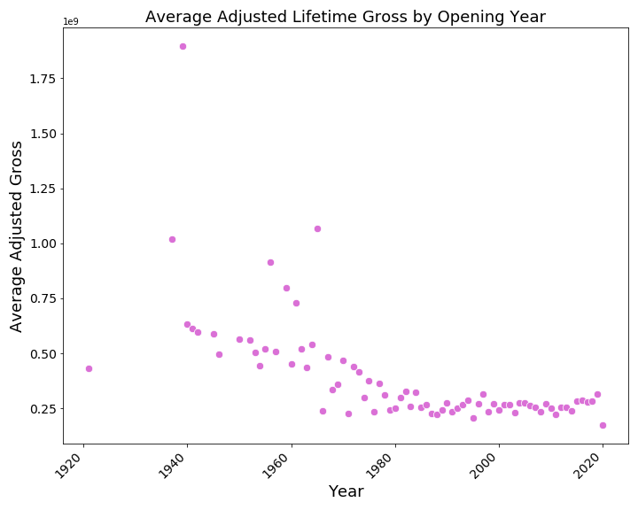
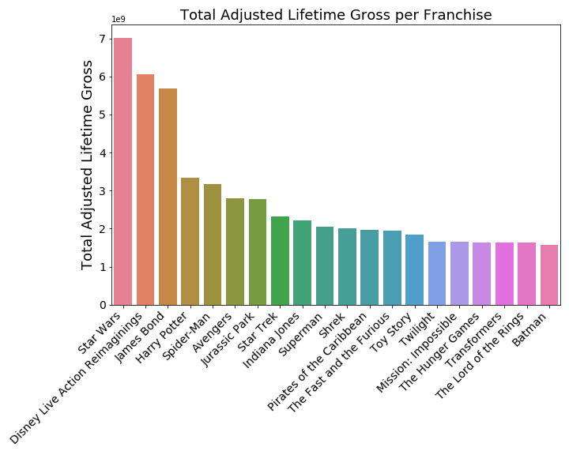
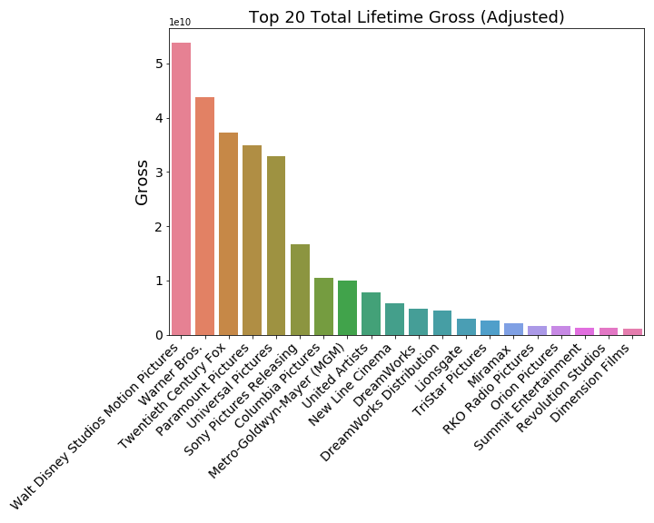
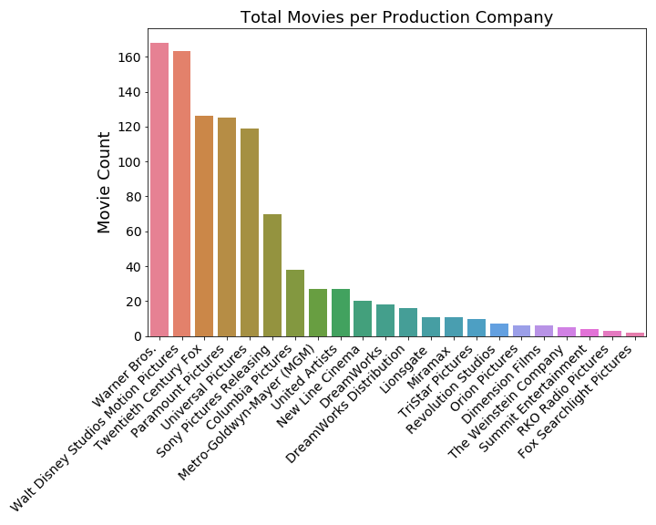

# Capstone Project

## Objectives

The global box office revenue in 2019 was over 42 billion dollars according to statista.com, and will continue to grow. Production companies may invest hundreds of millions of dollars in a single movie, hoping it will be the next box office success. The goal of this project is to predict the lifetime adjusted gross of domestic box office movies using a number of features defined for every movie. The data was obtained using Beautiful Soup from both boxofficemojo.com and imdb.com. The data was scrubbed by converting categorical columns to binary columns using multilabelbinarizer() and binning. The data was explored with self built plotting function using seaborn data visualization. The data was modeled using several supervised learning regressors. The data was interpreted using various scoring techniques and feature importance graphing. 

## The Data

The data used in this project was web scraped using beautiful soup from two websites, https://www.boxofficemojo.com/ and https://www.imdb.com/. Within box office mojo, there is a list featuring the top 1000 lifetime adjusted gross box office movies. From this ranking list, the movie name with year, movie ID (assigned by IMDB), the domestic distributor, the earliest domestic release date, the mpaa rating, the run time, the genres, the cast (top 4 actors/actresses) and the crew, including director, producer, production designer, editor, writer, cinematographer and composer, were all collected. Also within box office mojo, the franchise of all movies (even those outside of this top 1000 list), as well as movie name, was collected. Within IMDB, the movie budgets and movie names within the top 1000 list were scraped using the movie ID which carried over from box office mojo. 

## Data Analysis

## Findings

The best performing model was built by GradientBoostingRegressor() using grid search cross validation and a hyperparameter grid - the mean absolute percent error of the model was 31%. The feature importance graph of this model showed that franchise was an important feature in correctly predicting the target. In response, more franchise related predictors were added to the model in the form of a binary matrix, resulting in an improvement of the model. The final model was able to predict the lifetime adjusted gross of a movie, on average, with an error of +/- 30%. 

## Table of Contents

[Jupyter_Notebook: BOM Summary Scrape](movieSummaryScraper.ipynb)

[Jupyter_Notebook: BOM Franchise Scrape](franchiseScraper.ipynb)

[Jupyter_Notebook: IMDB Budget Scrape](budgetScraper.ipynb)

[Jupyter_Notebook: EDA](capstoneEDA.ipynb)

[Jupyter_Notebook: Regressor Models](capstoneModelRegressors.ipynb)

[Summary_Slides](capstonePresentation.pdf)

[Blog_Post](https://medium.com/@stacyshingleton/predicting-box-office-hits-d335e22d9c37)